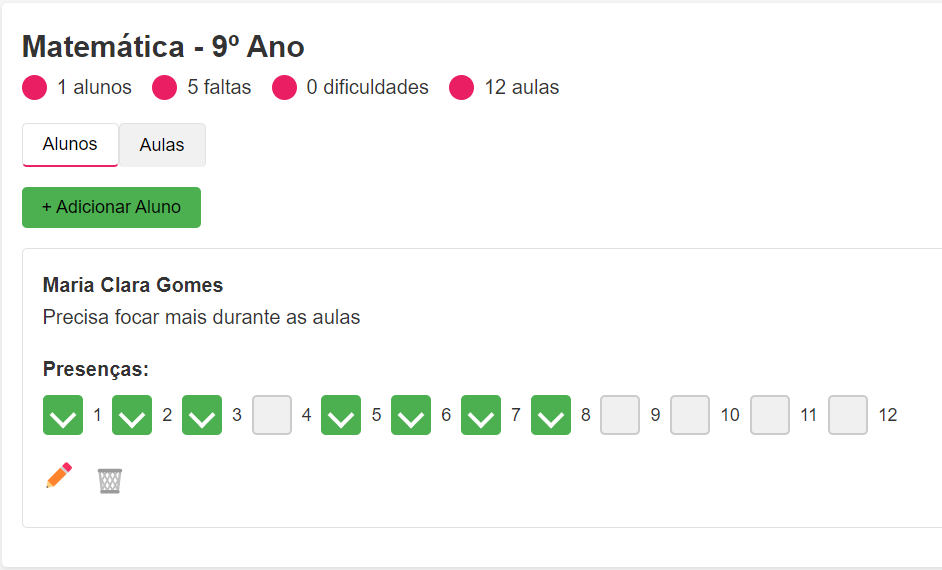

# Sistema de Acompanhamento de Alunos

 

## Descrição

O **Sistema de Acompanhamento de Alunos** é uma aplicação em desenvolvimento para gerenciar e monitorar a presença e desempenho de alunos em diferentes turmas. O sistema permite adicionar novas turmas, gerenciar alunos, registrar presenças e editar informações sobre aulas e estudantes.

## Recursos Atuais

- Adicionar e gerenciar turmas
- Adicionar e editar alunos
- Registrar e visualizar presenças dos alunos
- Excluir turmas e alunos
- Interface responsiva para visualização em dispositivos móveis

## Em Desenvolvimento

Este projeto está em estágio inicial de desenvolvimento e está sendo construído em colaboração com o dono original do projeto, Luan Oliveira. Algumas funcionalidades podem estar em fase de implementação, e o design pode passar por mudanças à medida que o desenvolvimento avança. A contribuição é bem-vinda!

